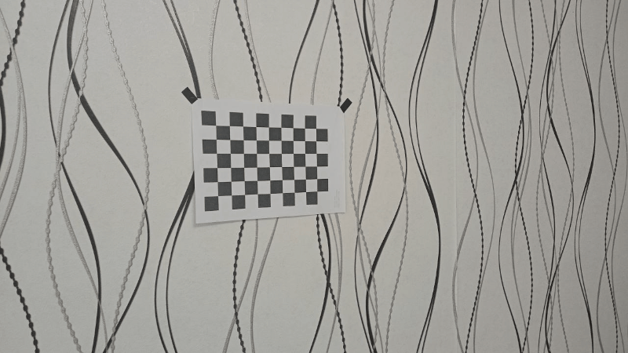

# 🎯 Camera Calibration using OpenCV

[](https://github.com/Bit-Maximum/Camera-Collibration/blob/main/README.md)
[](https://github.com/Bit-Maximum/Camera-Collibration/blob/main/translation/README.ru.md)

### Maxim Merkurev
_Far Eastern Federal University, 2025_

---

## 📚 About the project

This project performs **camera calibration** using a set of chessboard images with the **OpenCV** library.

Goal: Determine the **camera matrix** and **distortion coefficients** required to correct image distortion.

---

## 🚀 How to Run

1. Clone the repository:
```bash
git clone https://github.com/Bit-Maximum/Camera-Collibration.git
cd Camera-Collibration
```

2. Install the dependencies:
```bash
pip install -r requirements.txt
```

3. Place your chessboard images in the `images/` directory. Example: photos taken using a Realme C21 smartphone:



> _It's recommended that the board fills a large portion of the frame and is captured from various angles._

4. Run the calibration script:
```
python calibration.py
```

> During execution, the detected corners will be shown for each image.

## 📂 Project Structure
```
project_root/
├── images/                 # Folder containing chessboard images
│   ├── image1.jpg
│   ├── image2.jpg
│   └── ...
└── calibration.py          # Main camera calibration script
```

## 🧾 Output:

### The program will print to the console:
- 📐 Camera matrix (camera_matrix)
- 🔍 Distortion coefficients (radial_distortion).
- 🌀 Rotation vectors (rotation_vectors)
- 📦 Translation vectors (translation_vectors)

### 💡 Example Output:
```
Camera matrix:
[[fx  0 cx]
 [ 0 fy cy]
 [ 0  0  1]]

Radial distortion coefficients:
[ k1, k2, p1, p2, k3 ]

Rotation vectors:
[array([...]), array([...]), ...]

Translation vectors:
[array([...]), array([...]), ...]
```

## 📝 Tips

* Use **sharp images** with good lighting.
* Make sure the chessboard occupies a **large portion** of the image — this improves accuracy.
* For reliable calibration, it's best to use **at least five images**.
